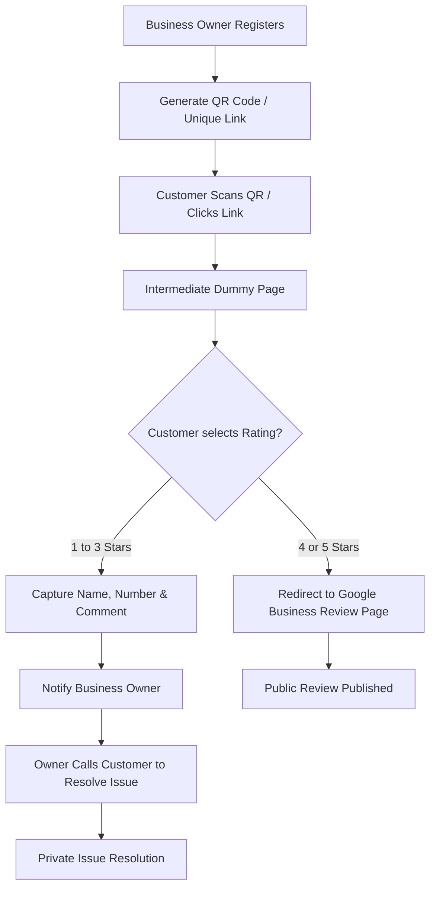

# Review Boost App - Workflow & Logic

This document outlines the operational flow of the **Review Boost App**, designed to help business owners manage their Google Business Reviews effectively.

## 🌟 App Overview
The application allows business owners to register their business, generate a unique review link/QR code, and filter customer feedback. High-quality feedback (4-5 stars) is pushed to Google, while constructive feedback (1-3 stars) is captured privately for the owner to resolve.

---

## 🛠️ Main Flow

### 1. Business Registration
*   **Input**: Owner name, Business Name, Contact Number, and **Google Business Review Page Link**.
*   **Action**: The system generates a unique **QR Code** and a **Shortened URL** specifically for that business.

### 2. Customer Interaction (The "Review Twist")
*   **Trigger**: A customer scans the QR code or clicks the link.
*   **Redirect**: The customer is sent to a **Intermediate Review Page** (Dummy Page).

### 3. Intermediate Review Page
The customer sees a simple, clean UI containing:
*   **Rating**: 1 to 5 Stars selection.
*   **Input Fields**: Name, Mobile Number, and Comment.

### 4. Logic Handling
*   **Positive Experience (4 or 5 Stars)**:
    *   If the user selects 4 or 5 stars, they are **immediately redirected** to the official Google Business Review page to post a public review.
*   **Constructive Feedback (1, 2, or 3 Stars)**:
    *   If the user selects 1-3 stars, their details (Name, Number, and Comment) are **Captured** and stored in the database.
    *   **Notification**: The business owner receives the customer details on their mobile app.
    *   **Outcome**: The owner can now directly call the customer to resolve the issue privately before it turns into a negative public review.

---

## 🗺️ Flowchart

---

## 🎯 Key Benefits
1.  **Protect Reputation**: Prevent low-star reviews from going public.
2.  **Direct Communication**: Give owners a chance to "fix" a bad experience immediately.
3.  **Boost SEO**: Increase the frequency of high-star public reviews on Google.
4.  **Customer Insights**: Gather detailed feedback even when customers are unhappy.
